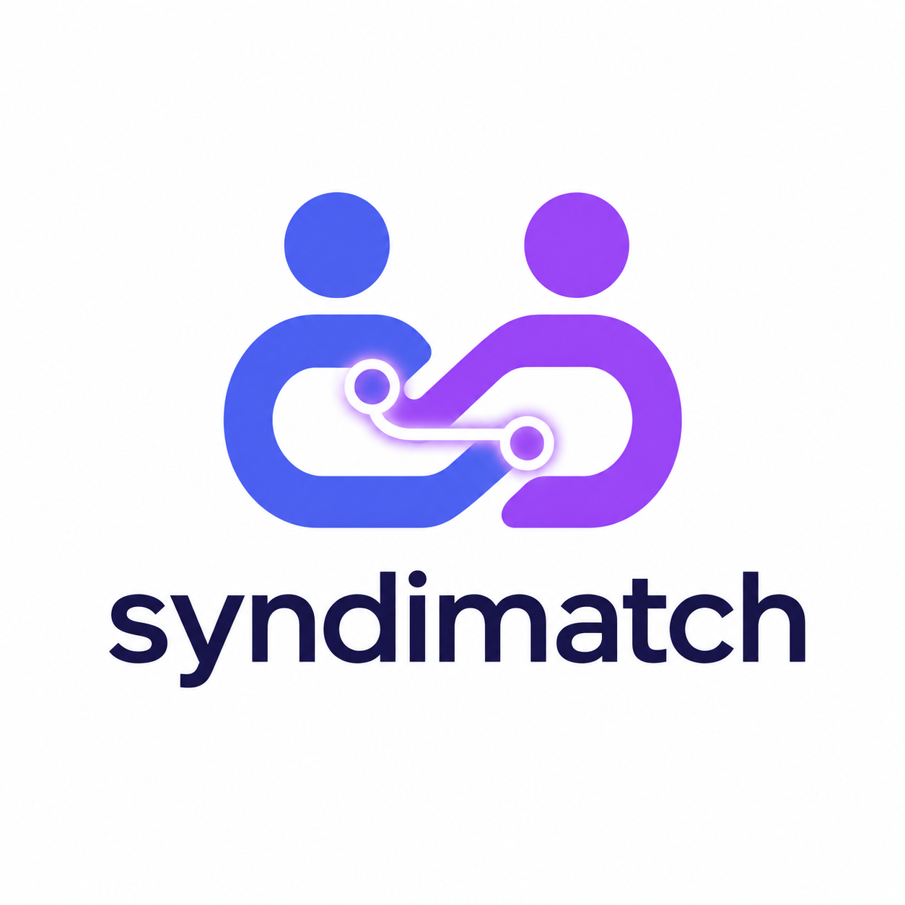

SyndiMatch — AI-Native Co-Founder Matching
  

Status: In Private Beta

Next.jsSupabaseTypeScriptLicense: MIT

SyndiMatch — это AI-платформа подбора сооснователей стартапов. Вместо поиска «похожих» людей, алгоритм ищет комплементарные связи, используя многослойную оценку: векторную семантику, психометрику (Big Five / OCEAN), матрицу конфликтов (Thomas-Kilmann) и совместимость намерений (Intent).
🧠 Matching Engine

Алгоритм матчинга работает на 4 слоях:

    Vector Similarity — pgvector (косинусная близость эмбеддингов профилей).
    OCEAN Complementarity — комплементарность по 5 осям личности (Big Five).
    Behavioral Breakdown — матрица стилей разрешения конфликтов (Thomas-Kilmann).
    Intent Compatibility — хард-фильтр намерений (например, "есть идея" + "ищу команду").

🛠 Tech Stack

    Frontend: Next.js 16 (App Router, Server Components, Turbopack), TypeScript (strict), Tailwind CSS.
    Backend: Next.js Route Handlers, Supabase (PostgreSQL, pgvector, Row Level Security).
    AI / LLM: Anthropic Claude (Haiku для чат-авто-ответов, Sonnet для аватаров).
    Infrastructure: Vercel (Edge Functions), Upstash Redis (Rate Limiting), PostHog (Analytics).
    CI/CD: GitHub Actions (Type-check, Vitest, Build).

🚀 Quick Start
Prerequisites

    Node.js 20+
    Supabase account & project
    Upstash Redis account
    Anthropic API key

Installation

    Clone the repo:

    git clone https://github.com/aiagent2046-coder/ai-co-founder-matching.gitcd ai-co-founder-matching

    Install dependencies:
    bash
     
      
     
     
    npm install
     
     

    Setup environment variables:
    Copy .env.example to .env.local and fill in your keys.
    bash
     
      
     
     
    cp .env.example .env.local
     
     

    Setup Database:
    Run the SQL from supabase/migrations/0000_init.sql in your Supabase SQL Editor to create tables, indices, RLS policies, and the match_founders RPC function.

    Run the development server:
    bash
     
      
     
     
    npm run dev
     
     

🔒 Security

     Row Level Security (RLS): Enabled on all sensitive tables. API routes use ANON_KEY with user JWT to enforce RLS.
     Server-side Auth: Next.js Middleware (middleware.ts) protects all /app/* routes.
     Rate Limiting: Upstash Redis sliding window on auth, messaging, and swiping APIs.
     Validation: Zod schemas on all incoming API request bodies.

📄 License

Distributed under the MIT License. See LICENSE for more information.
   
